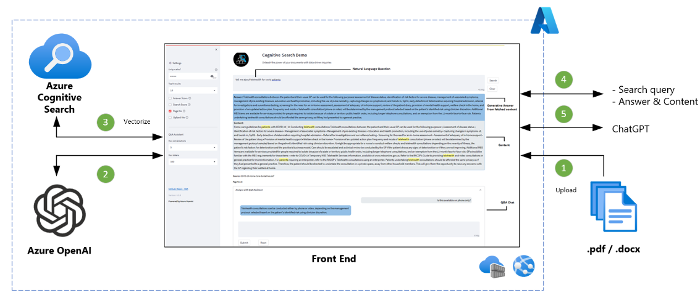

# Azure OpenAI Semantic Search Demo | Document Upload | ChatGPT



## About

Version: 0.9.8

The ability to conduct semantic search on vector data is a powerful feature that allows you to find relevant content based on a specific natural language query. This demo is helpful for showcasing and comprehending the abstractive responses generated from your own data in PDF or Word format documents.

This solution has been created by drawing inspiration from existing Enterprise Chat GPT and Document Q&A vector search demos, however it uses a simplified architecture pattern and offers following features, most of which are unique to this implementation.

## Key Features
- _Simplified architecture_
- _Built-in document cracking (.pdf, .docx)_
- _Utilise text embeddings_
- _Upload own document and ask questions_
- _Q&A with ChatGPT_

## How to deploy?
**Run locally from Visual Studio Code or command prompt**
- Open VS Code terminal or command prompt.
- Clone this repository and open in VS Code.
- Create a new conda environment
    - ```conda create -n openaidemo_py39 python=3.9 anaconda```
    - ```conda activate openaidemo_py39```
    - For more info go to [Conda documentation](https://conda.io/projects/conda/en/latest/user-guide/tasks/manage-python.html) 
- Navigate to _misc_ directory and run 
    - ```pip install -r requirements.txt```
- Provision Azure OpenAI service
    - Under deployments within Azure OpenAI Studio, deploy the models specified on 
    - Model for text search e.g. text-search-babbage-doc-001
    - Model for text generation e.g. text-davinci-003
    - Model for ChatGPT e.g. gpt-35-turbo
    - Model availability varies by region in which OpenAI service is provisioned in Azure.
    - For more info go to [Create a resource and deploy a model using Azure OpenAI](https://learn.microsoft.com/en-us/azure/cognitive-services/openai/how-to/create-resource)
- Open _modules/utilities.py_ file and scroll to very bottom
    - Update value for "deployment_name" tag for each of 3 model versions you provisioned in step above.
- If you have used the 3 models mentioned in steps above, no changes are required in _app/app.py_ file.
    - Otherwise, update values for aoai_embedding_model and aoai_text_model variables at the begining of app/app.py file.
- Provision Azure Cognitive Search service
    - Make sure you requested _aka.ms/VectorSearchSignUp_ and request was approved
    - Create a new search index using provided Postman script   
- Almost there, rename _.env_template_ file to _.env_ 
    - Renamed file should be placed  within same directory as this readme.md file. 
    - Replace placeholders with correct values.    
- Navigate to /app directory and run following command from VS Code terminal. This will open the App UI in a browser window.
    - ```streamlit run app.py```

**Run as a local docker container**
- Complete all configuration steps from section above before running any steps below.
- ```docker build -t oaisearch:0.9.8 -f ./docker/dockerfile .```
- ```docker run -d -p 8501:8501 oaisearch:0.9.8```
- Open web browser and go to http://localhost:8501 URL to see the app UI.

**To Azure**
- More info will be added soon.

## Looking for OpenAI + Redis Semantic Search Demo?
- [Azure OpenAI Semantic Search Demo | with Document Upload via UI](https://github.com/MaheshSQL/openai-vector-search-demo)

## Looking for Azure Cognitive Semantic Search | Large documents with OpenAI enrichment?
- [Azure Cognitive Semantic Search | Large documents | OpenAI enrichment](https://github.com/MaheshSQL/cognitive-semantic-search-openai-accelerator)

